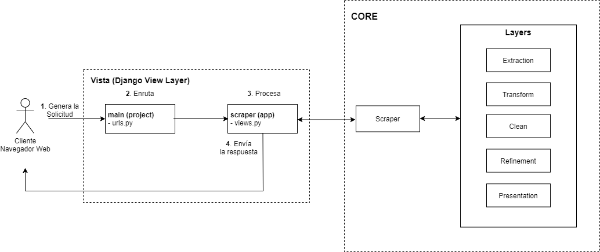

# Scraper para productos

Microservicio creado en DJANGO (Django Rest Framework) que permite consultar los productos de ML dada una categoria, para lograr tal objetivo se hace un scrapping de la pagina segun la categoria.

## Arquitectura



## Instalacion

Clone el proyecto, ubiquese dentro de la carpeta use el siguiente comando para instalar el entorno virtual y las dependencias.

```bash
    $> pipenv shell & pipenv install
```

*Nota:* Debe instalar [pipenv](https://pypi.org/project/pipenv/) para ejecutar la instalacion.
## Use

El microservio provee un API Rest, por ende se debe levantar un servicio web. Usted puede levantar un servidor web rapidamente usando los siguientes comandos: 

```bash
1.- Cargar el entorno virtual:
    $> pipenv shell

2.- Correr el servidor web:
    # 8888 is the port
    $> python manage.py runserver 8888
```

## Puntos de Entradas (EndPoints)

Solo se cuenta con un punto de entrada:

### Solicitud
Ruta: /scraper
Metodo HTTP: POST
Body:
```
{
    "provider": "mercadolibre",
    "provider_url": "https://celulares.mercadolibre.com.co",
     "provider_category": "xiaomi",
	
	"page_ini": 1,
	"page_end": 1,
	
    "clean_common_words": [
        "celular",
        "smartphone",
        "combo",
        "xiaomi",
        "xioami",
        "libre",
        "nuevo",
        "de",
        "y",
        "es"
    ],
    "clean_sames_words": {
        "pocophone": "poco",
        "6-ram": "6ram",
        "64mpx": "64mpx",
        "64-mpx": "64mpx",
        "128g": "128gb",
        "128gbb": "128gb",
        "mpx": "mp"
    },
    "classifier_score_min": 90
}
```

### Solicitud

La respuesta es un json con tres secciones: simple, refined_wit_rom y data.

- En la seccion simple se pude ver la cantidad items discriminado por el modelo de telefono.

- En la seccion refined_with_rom se discrimina ademas del modelo por la capacidad de ROM del telefono, que deacuerdo las pruebas es la caracteristica descriptiva mas importante.

- En la seccion de data se puede ver la informacion analizada con su respectiva clasificacion, puntaje y categorizacion.

Example:

```
{
  "simple":{
        "poco-x3-nfc": 2,
        "redmi-9c-naranja": 2
    },
   "refined_with_rom":{
        "poco-x3-nfc-rom-64": 1,
        "redmi-9c-naranja-rom-64": 1
    }
   "data": {
    "refined": {
      "poco-x3-nfc": {
        "rom": {
          "64": [
            14
          ]
        },
        "ram": {
          "0": [
            14
          ]
        },
        "battery": {
          "0": [
            14
          ]
        },
        "camera": {
          "64": [
            14
          ]
        }
      },
      "full": [
      {
        "count": 2,
        "group_slug": "poco-x3-nfc",
        "slug": "poco-x3-nfc-64gb-azul",
        "item": {
          "original": {
            "title": "Celular Xiaomi Poco X3 Nfc 64gb Azul",
            "price": "1.199.900",
            "image": "https://http2.mlstatic.com/D_NQ_NP_833694-MCO43706034002_102020-V.jpg"
          },
          "clean": {
            "title": "celular xiaomi poco x3 nfc 64gb azul",
            "slug": "poco-x3-nfc-64gb-azul",
            "price": "1.199.900",
            "image": "https://http2.mlstatic.com/D_NQ_NP_833694-MCO43706034002_102020-V.jpg"
          }
        },
        "same_items": [
          {
            "original": {
              "title": "Celular Xiaomi Poco X3 Nfc 64gb Azul",
              "price": "1.199.900",
              "image": "https://http2.mlstatic.com/D_NQ_NP_833694-MCO43706034002_102020-V.jpg"
            },
            "clean": {
              "title": "celular xiaomi poco x3 nfc 64gb azul",
              "slug": "poco-x3-nfc-64gb-azul",
              "price": "1.199.900",
              "image": "https://http2.mlstatic.com/D_NQ_NP_833694-MCO43706034002_102020-V.jpg"
            }
          }
        ]
      }
   }
}
```
